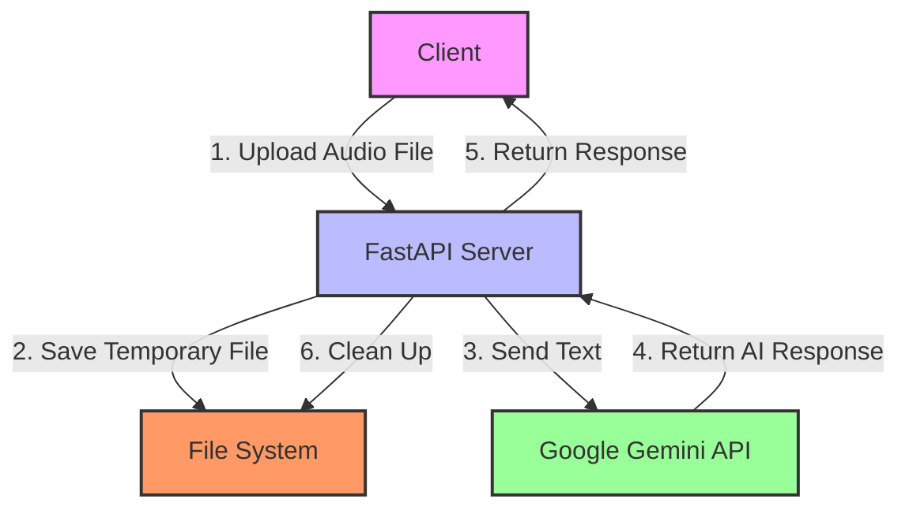
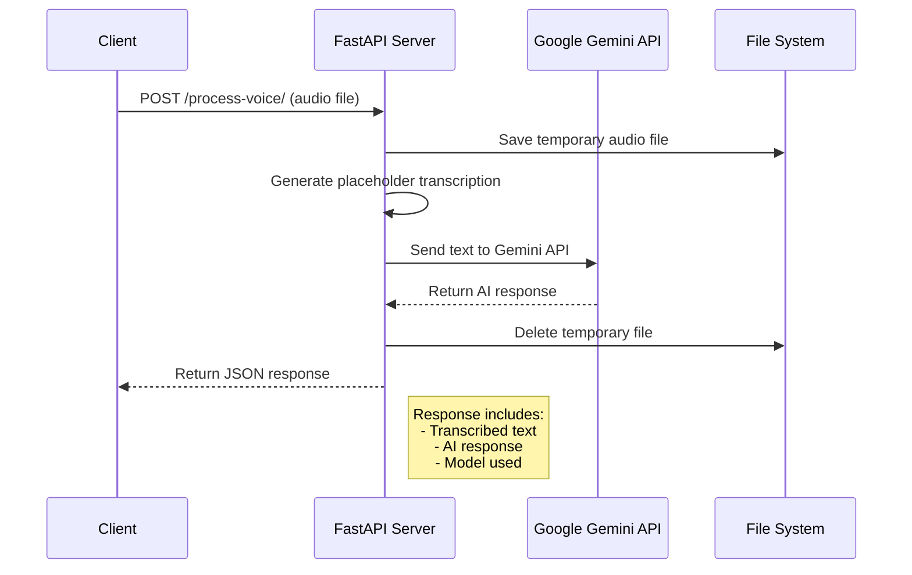

# Voice Processing API Architecture

## System Architecture

## Sequence Diagram

## Components Description

1. **Client**
   - Sends HTTP POST requests with audio files
   - Receives JSON responses with transcriptions and AI-generated text

2. **FastAPI Server**
   - Handles file uploads and validation
   - Manages temporary file storage
   - Coordinates with external APIs
   - Implements error handling and response formatting

3. **File System**
   - Temporarily stores uploaded audio files
   - Files are automatically cleaned up after processing

4. **Google Gemini API**
   - Processes text prompts
   - Generates contextual responses
   - Handles natural language understanding

## Data Flow

1. Client uploads an audio file to the `/process-voice/` endpoint
2. Server validates the file type and saves it temporarily
3. Server generates a placeholder transcription (in a real implementation, this would use a speech-to-text service)
4. Server sends the transcribed text to Google's Gemini API
5. Gemini processes the text and generates a response
6. Server formats the response and returns it to the client
7. Temporary files are cleaned up

## Error Handling

- Invalid file types are rejected immediately
- API rate limits and timeouts are handled gracefully
- Temporary files are always cleaned up, even if an error occurs
- Meaningful error messages are returned to the client
